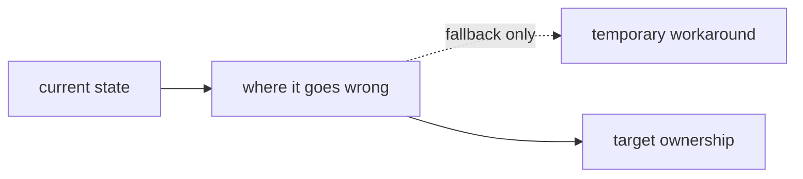

# Creating Issues

## De-bias before you file (read this first)

- A confident issue makes the implementer skip verification.
- Every prescription needs verified evidence — or a research gate.
- Run a second pass after drafting, before filing. Always.

**Example: a real issue, before and after.**

> ### Before
>
> **Problem.** Both routes call `Sandbox.connect()` and never `disconnect()`. Connection lives until GC.
>
> **Shape of the fix.** Wrap in `try/finally`, call `sandbox.disconnect()`.
>
> **Acceptance.** `grep -c sandbox.disconnect` ≥ 1.

> ### After
>
> **Problem.** Two routes call `Sandbox.connect()` with no matching cleanup. Whether this leaks depends on what `connect` returns — research determines which.
>
> **Shape of the fix.** If the SDK has a transport-cleanup primitive, balance every `connect` with it. Or close as wontfix if no primitive exists.
>
> **Research.** Verify the SDK exposes a cleanup method. If not → close issue, no PR.

**Outcome.** Research found the SDK has no `disconnect()`. Issue closed wontfix. The "before" version would have shipped a no-op wrapper.

### What bias looks like

Catalogue these patterns. If you find them in your draft, fix them.

- **Premature prescription.** The Shape-of-the-fix or AI block specifies a mechanism (`try/finally`, a function name, a hide-vs-disable choice) before the underlying premise is verified. Smell: *the research checklist contradicts the prescription* (the checklist asks "verify X exists" but the prescription assumes X). Fix: move the prescription behind the verification — "if X exists, do Y" — or strip it down to a directional shape ("balance connect with cleanup; mechanism follows what the SDK supports").
- **Strawman alternatives.** "Why this shape instead of X" lists alternatives so weak that rejecting them is automatic. The reader can't tell whether the chosen shape is right or whether it's just less stupid than the strawmen. Fix: list alternatives a reasonable engineer would actually consider, with genuine trade-offs, including "do nothing" and "scope tighter."
- **Vibes-rejections.** Alternatives rejected with "obvious", "clean", "too clever", "messy". These are aesthetic judgments wearing technical clothes. Fix: state the concrete cost of the alternative (test surface, blast radius, reviewer cognitive load measured in something) or stop rejecting it.
- **Implementation-shaped acceptance.** `grep -c sandbox.disconnect returns ≥1` checks that the implementer typed the prescribed string, not that the underlying problem is solved. A future SDK rename and the check still passes. Fix: write acceptance as a behavioural observation where feasible — "after N requests, sandbox connection metric does not grow." Where behaviour can't be observed cheaply, say so and fall back to structural checks honestly.
- **Author bias.** You wrote the code the issue is patching. Your "right shape" is what you'd write, not necessarily what's right. Smell: every signature in the issue uses your naming conventions; every alternative you "considered" is one you'd already dismissed before drafting. Fix: explicitly flag this in the issue ("author wrote the originating PR") and lower the prescriptive temperature accordingly — signatures become starting points, not specs.
- **Status-quo bias.** The issue patches the current design without asking whether the design is right. Fix: add one sentence to "Considered alternatives" arguing for tearing out the system being patched.
- **Sunk-cost framing.** "PR #N follow-ups" assumes #N lands as-is and these are downstream cleanup. Some "follow-ups" are actually evidence that #N's design is wrong. Fix: separate lineage (which problems pre-date #N? which came with it?) and ask whether any of them belong in #N itself.
- **Bundling.** Two separable concerns under one Problem statement (e.g., "hide the button when X *and* relabel it when Y"). One issue = one change. Fix: split, or downgrade the secondary concern to "out of scope; file separately if pursued."
- **Unproven premises.** The Problem asserts something the AI block then prescribes around. "The connection lives until JS GC reclaims it" — verified how? Smell: the verb is "is" or "leaks" instead of "may" or "if X then Y." Fix: rewrite the problem as a hypothesis with a check ("whether this leaks depends on X — research below determines which") *or* verify before filing.
- **No "do nothing" exit.** Every issue assumes action is required. Some don't deserve action. Fix: include a "close as wontfix if research shows Y" branch in the research-first checklist. The implementer needs explicit permission to invalidate the premise. (Without this permission, they'll write the no-op wrapper rather than push back.)
- **Missing risk asymmetry.** A data-loss bug and a UX papercut treated identically. Fix: one line on worst-case impact ("data loss" / "annoyance" / "operator confusion") so the reader can size effort.
- **No quantitative grounding.** "Sometimes happens" / "could matter under load." Fix: a SQL count, a Sentry occurrence count, a load-test number — *something*. If the number is zero, the issue is wontfix.
- **Defensive prescription.** "Wrap cleanup in try/catch in case it throws" — when no evidence shows it can throw. Smell: the prescription defends against an unverified threat. Fix: mark the defence as conditional on the research check that would prove the threat real.
- **Leading the witness.** The Verify block narrates the expected output ("first command shows X; second returns nothing — the field isn't surfaced"). The reader stops thinking; they read the narration as the result. Fix: give the command, let the human run it, let them observe.

### How to do the second pass

After drafting, reread the issue with these prompts. Each is a one-question filter — if you can't answer it cleanly, the section needs a rewrite.

1. **Premise check.** Underline every factual claim in the Problem block. For each, where's the evidence? If it's "I read the code", that's fine for some claims; for behavioural claims ("this leaks", "this is identical", "this matters"), evidence is a reproduction, a metric, a count, a Sentry link, a SQL query.
2. **Prescription audit.** Highlight every imperative ("wrap", "extract", "hide", "use"). For each: is the premise behind it verified, or is it on the research checklist? If on the checklist, demote the imperative to "if research confirms X, then Y."
3. **Alternative steel-manning.** For each alternative in "Considered (and trade-offs)", ask: would a reasonable, non-author engineer pick this alternative? If no engineer would, it's a strawman — replace it with one they would. Include "do nothing", "tear out the system instead", "scope tighter" as standard candidates.
4. **Acceptance reread.** For each acceptance criterion, ask: does this check the *observable behaviour* I'm trying to fix, or does it check that the implementer typed what I wrote? Rewrite as behaviour where feasible; admit structural checks honestly otherwise.
5. **Authorship test.** Did you write the code being patched? If yes, add an "author wrote the originating change" sentence to the issue and lower the temperature on signatures and helper names — they become starting points, not specs.
6. **The "that's it?" prompt.** After your first round, ask: am I done finding bias, or have I just stopped looking? The first round catches the obvious patterns (vibes-rejections, missing alternatives). The second round catches the structural ones (lineage flattening, status-quo bias, missing risk asymmetry). If you've only done one round, do another.
7. **The wontfix exit.** Does the research-first checklist contain at least one branch that closes the issue without a PR? If not, the implementer has no permission to invalidate the premise — they'll ship something rather than push back. Add the exit explicitly.
8. **Stripping ceremony.** Read each "Why this shape instead of X" paragraph aloud. If it sounds like an argument you're winning, it's biased. If it sounds like a list of trade-offs the reader could weigh themselves, it's calibrated.

A debiased issue reads less confident than a biased one. That's the point. The implementer's confidence should come from the research they run, not from the issue's tone.

### When to skip the second pass

- Mechanical bug fixes with a stack trace and a reproduction (the evidence carries the issue).
- Issues where the cost of a wrong fix is trivially recoverable (one-character typo in a comment).
- Issues where the fix is a single line of config and there's no design surface to bias.

For everything else — anything involving a refactor, a design choice, a UX call, a performance claim, an architecture change — the second pass is mandatory.

---

Every issue has two readers, and they want different things.

- **The human** is an operator. They decide whether the issue is real, prioritise it, assign it. They skim, verify with one command, move on. If the first 90 seconds of reading don't tell them the problem and let them confirm it exists, the issue fails.
- **The AI** is the implementer. It reads the whole thing once and writes the PR. If it has to guess at file paths, function signatures, or test shapes, it produces slop. The AI block is where implementation context lives, and more is better — up to the point where it stops being specific.

Split the issue into two literally-named blocks: `# For humans` and `# For AI`. The reader of each block can ignore the other.

## Shape

````markdown
# For humans

**Problem.** One short paragraph. What's observed or what's wrong.
Concrete. No editorialising. No "this is critical." If it reveals
motive, just enough to decide whether to act.

**Before.** Optional for architecture/lifecycle/resource-ownership issues.
Use 2-4 bullets that show the current failure loop in plain language.

**After.** Optional for architecture/lifecycle/resource-ownership issues.
Use 2-4 bullets that show the target ownership model in plain language.



**Operator check.**
```bash
# One command, maybe two, that lets the operator confirm the problem is real.
# If there's no way to verify from the outside, say so: "Verify by X" in prose.
```

**Shape of the fix.** One or two sentences on the direction. Not the
implementation. The human doesn't need the implementation; they need
to know whether the direction is right.

**Depends on.** Other issues that must land first, or "Nothing."

---

# For AI

[Everything the implementer needs. See rules below.]
````

## What goes in each block

### `# For humans`

- Observed behaviour or structural pain.
- For architecture, lifecycle, ownership, or cleanup issues: a short `Before` / `After` contrast and a Mermaid flowchart if it makes the issue clearer.
- One-shot verification (command, query, URL), framed as an operator check with what to look for. Avoid dumping a command with no interpretation.
- Fix direction — *shape*, not steps.
- Dependencies on other issues.
- Total length: aim for under 120 words for simple issues. Architecture/lifecycle issues may be longer when the extra words are spent on before/after bullets or a diagram that lets a human see the shape immediately.

**Do not include in this block**: function signatures, test names, acceptance criteria, non-goals. That's the AI's job, and humans skip it. File paths are allowed only when they are part of the operator check.

### `# For AI`

- **Scope discipline.** What's explicitly in and out of scope. Without this, scope creeps during implementation.
- **Research first (calm and bounded).** See below — this is a specific shape, not a free-exploration prompt.
- **Files to modify / add / delete.** Full relative paths.
- **Function signatures.** Exact types. If adding a new function, give its signature. If modifying an existing one, say where (file:line or name).
- **Contracts.** Input → output examples. State machines where relevant.
- **Call-site changes.** The concrete diff shape at the integration points.
- **Tests.** What each test asserts. If a test "would have caught a specific bug," name it. One test per behaviour, not one test per function.
- **Non-goals.** Explicit. The implementer will look for the line between "do this" and "don't do this."
- **Acceptance.** Each criterion verifiable by a command or an observation. No "works correctly."
- **Why this shape instead of X.** One paragraph explaining why the *obvious simpler fix* was rejected. Prevents the implementer from re-litigating during the PR.

No upper bound on length. Detail is cheaper than a clarifying question.

#### Research first (calm and bounded)

The goal of this block is **to catch the 10% of cases where the plan is based on a wrong assumption**, not to re-derive the plan. It's a pre-flight check, not a re-exploration.

Shape:

```markdown
## Research first (budget: ~20 minutes)

**Default action:** if all checks below pass, proceed with the plan as written below. Do not expand scope based on what you find; file unrelated findings as new issues.

**Must verify (each has a fallback if wrong):**

- [ ] `<claim>` — verify: `<one-line command>`
  - If wrong: `<specific fallback, not "re-plan">`

**Prior art:**

- `git log --oneline --grep="<topic>" -- <path>` — if a similar change was reverted, read the commit message before starting.
- Related issues: `#<n>`, `#<n>`. Read only if touching the same files.

**Out of scope even if discovered:**

- <side finding the implementer might stumble on>: file a new issue, do not bundle.
```

Rules for the research block:

- **Every "must verify" has a fallback.** "What happens if wrong?" must be answered up front. If the answer is "we'd need to re-plan," the issue isn't ready.
- **No "unknown unknowns" as a standalone section.** That phrase licences indefinite exploration. Either a question is specific enough to verify with a command, in which case it goes in "must verify" — or it's vague, in which case the issue isn't well-scoped yet.
- **Priority over completeness.** Three "must verify" items is usually right. Ten means the issue is doing the implementer's job.
- **Prior art is required for surgeon fixes.** If this PR is the third attempt at the same problem, the reader needs to know why the first two didn't stick.
- **"Out of scope even if discovered" prevents scope creep.** Research often turns up adjacent bugs. Name the ones you expect and commit to not bundling.

The block's job is to end with: *"proceed with the plan."* Not: *"continue researching until confident."*

## What never goes in an issue (either block)

Never include:

- Email addresses, personal names, display names.
- Customer workspace names, workspace IDs, sandbox IDs from real tenants, domain labels tied to real users.
- IP addresses of users or non-infrastructure hosts.
- Tokens, secrets, credentials, even partial.
- Internal Slack threads, DMs, support-ticket content, or anything pulled from private channels.
- Screenshots that show any of the above.
- Speculation on who did what wrong, or blame framings.

Use placeholders where needed:

- `<sandbox_id>`, `<workspace>`, `<user_id>`, `<domain>`, `<email>`
- `org_id`, `workspace_id`, `domain_id` as abstract variables

Infrastructure hostnames (`pr-<N>.staging-s2.alive.site`), internal service names (`alive-workspaced`, `shell-server-go`), file paths, commit hashes, PR numbers, and issue numbers are all fine.

## Sizing

One issue = one change that one person can land in one PR.

- Too big ("rework billing") → split into an epic + child issues via `/roadmap`.
- Too small ("rename variable") → just do it, no issue.
- Right ("Drain reaps children but not grandchildren; orphan ports on next restart") → one clear thing with a clear fix.

If the AI block lists changes to three unrelated subsystems, you have three issues.

## Symptom-nurse vs surgeon fix

A symptom-nurse issue patches the proximate cause: "fix the trailing-comma bug in `replaceAllowedHosts`." A surgeon issue fixes the class the bug belongs to: "stop patching files we should own."

When multiple symptoms share a root cause, prefer one surgeon issue over N nurse issues. The surgeon shape requires a `Why this shape instead of X` paragraph because it costs more up-front and the motivation has to be in the issue, not in the implementer's head.

Heuristic: if the same function has been patched twice in the last six months, the third patch is a surgeon issue.

## Bug reports vs change proposals

The two-block shape works for both, with content differences:

**Bug report — human block** describes observed behaviour, a repro, and an expected behaviour. Fix direction may be "unknown, needs triage."

**Bug report — AI block** includes the full repro (environment, commands, logs), stack traces, affected files guessed from the traceback, and acceptance criteria that re-run the repro and see it not fail.

**Change proposal — human block** describes structural pain and fix direction.

**Change proposal — AI block** includes files/signatures/tests/non-goals as specified above.

## Find and link related work (do this before filing)

The AI forgets this step. Treat it as mandatory, not optional. Don't file cold — search for what's already happened in this area, then link it.

**Search:**

```bash
# Open + closed issues that touch the same topic
gh issue list --repo alive-home/alive --state all --search "<keyword>" --limit 30

# Closed PRs that touched the same area (catches reverts + prior attempts)
gh search prs --repo alive-home/alive --state closed "<keyword>" --limit 20

# By file or function name
gh search issues --repo alive-home/alive "<filename or symbol>" --limit 20
```

If a prior attempt was reverted or closed wontfix, read the closing message before drafting. Either argue against that decision in the new issue, or don't file.

**Decide ordering — who goes first?**

When two or more issues touch the same surface, state the order explicitly in `Depends on.` (human block). The implementer needs to know whether to start this one, or finish `#N` first. If you can't tell which goes first, the issues probably aren't separable — bundle, or re-split.

**Link them in the issue.** Use the patterns below — the right verb matters: `Depends on` and `Blocks` encode order; `Related to` is a pointer; `Supersedes` says "close the other when this lands."

## Linking syntax reference

Skip `@user` / `@team` mentions and discussions — those don't belong in issues. The rest:

**Auto-close on merge (PR body only — not commit messages, which get lost on squash):**

- `closes #123`, `fixes #123`, `resolves #123` (and their tenses)
- Use one per issue the PR fully addresses.

**Cross-references (no state change):**

- `#123` — same repo
- `GH-123` — alternate form, useful where `#` is intercepted
- `owner/repo#123` — cross-repo
- Full URL — works anywhere, renders the same

**Commits:**

- `a1b2c3d` — 7+ char SHA in same repo
- `owner/repo@a1b2c3d` — cross-repo

**Task lists (creates tracked sub-tasks with progress on the parent):**

- `- [ ] #123` in the body — renders progress bar on the parent issue.

**Sub-issues (parent ↔ child hierarchy):**

- No text shorthand, and `gh issue edit` has **no** sub-issue flag. Use the issue UI ("Add sub-issue") or the REST sub-issues API. `sub_issue_id` is the child's **database id** (`.id`), not its number:

  ```bash
  child_id=$(gh api repos/alive-home/alive/issues/<CHILD> --jq '.id')
  gh api --method POST repos/alive-home/alive/issues/<PARENT>/sub_issues -F sub_issue_id="$child_id"
  ```

- A child has exactly **one** parent; a duplicate or second-parent add returns HTTP 422 (safe to ignore). Distinct from "linked PRs" and from task-list checklists — use sub-issues for epics-with-children so the parent↔child hierarchy is real, not just a rendered progress bar.

**Code permalinks:**

- Paste `github.com/.../blob/<sha>/path#L10-L20` — renders as an embedded snippet. Use a SHA, not `main`, so the snippet doesn't drift.

**Org autolinks:**

- Configured prefixes like `JIRA-123` resolve to an external URL. Use the prefixes the repo already has; don't invent new ones.

**Phrasing for the issue body:**

- `Depends on #123` — must land first
- `Blocks #456` — this must land before #456
- `Related to #789` — same area, no ordering
- `Supersedes #111` / `Replaces #111` — close that one when this lands
- `Follow-up to #222` — downstream of work that already landed

## Creating the issue

```bash
gh issue create \
  --repo alive-home/alive \
  --title "Short factual title, verb-first when possible" \
  --body-file /tmp/issue-body.md
```

Write the body to a file first — never paste-heredoc, it breaks on backticks inside triple-fenced code blocks.

After creation, use `/roadmap` to attach milestone / project board / fields.

## Editing issues

Edit the body, never post updates as comments. Comments are invisible to search and future readers; an edit keeps the issue coherent.

```bash
gh issue edit <num> --repo alive-home/alive --body-file /tmp/updated-body.md
```

If `gh issue edit` fails with the GraphQL "Projects (classic) deprecated" error, use the REST PATCH:

```bash
jq -Rs '{body: .}' < /tmp/updated-body.md > /tmp/body.json
gh api -X PATCH "repos/alive-home/alive/issues/<num>" --input /tmp/body.json
```

## Anti-patterns

**Bad title:** "Billing is broken"
**Good title:** "Haiku model streams log 0 credits charged across all orgs"

**Bad human block:**
> We should probably look into why the preview is sometimes slow. There are various failure modes and we need to handle them better.

**Good human block:**
> **Problem.** `alive-workspaced` answers `/meta` with `{port:0, healthy:false}` forever when `alive.toml` is missing. Preview iframe spins on "Waking up... (N)" with no cap. Five distinct failure modes collapse into one spinner.
>
> **Verify.** `curl -sk https://49984-<sandbox_id>.<orchestrator>/meta` against a broken sandbox returns unhealthy indefinitely.
>
> **Shape of the fix.** Extend `/meta` to report four states (booting/healthy/config_error/crashed). Delete the default-config fallback. No new endpoints (stays inside `apps/workspaced/vision-workspaced.md`).

**Bad AI block:**
> Fix the state handling in workspaced. Update the meta endpoint. Add appropriate tests.

**Good AI block:** Lists `apps/workspaced/internal/meta/meta.go`, gives the new `metaResponse` struct, names the four states with their semantics, specifies `SetFailState(state, reason string)`, names the new test function, states what it asserts, lists non-goals (no new endpoints, no auth, no log streaming), and has explicit acceptance commands.

**Bad acceptance criterion:** "Preview works."
**Good acceptance criterion:** "Manual: sandbox without alive.toml → error panel appears in preview iframe within 15s with `state: \"config_error\"` in `/meta` response body."

## Rules summary

- **Run the de-bias second pass before filing** (see top of this skill). Confidently-written issues ship no-op fixes for unverified problems. The pass is mandatory for anything beyond mechanical bug fixes.
- Every prescription has either verified evidence behind it or sits behind a research-checklist gate ("if X, then Y").
- Research-first checklist contains at least one branch that closes the issue without a PR — the implementer must have explicit permission to invalidate the premise.
- Two blocks, always. `# For humans` first, then `---`, then `# For AI`.
- Human block ≤ 120 words.
- AI block starts with a bounded research checklist (≤20 min, each item with a fallback) *before* signatures. Default action: proceed with the plan. No open-ended "unknown unknowns."
- AI block as long as it needs to be; concrete paths, names, signatures.
- No personal / customer / secret data in either block.
- Fix direction in the human block is *shape*, not implementation.
- Acceptance is verifiable by a command or a specific observation — preferably *behavioural* not structural.
- One issue = one change = one PR.
- Prefer surgeon fixes over nurse fixes when symptoms share a root cause.
- Edit issues; don't comment them.
- Before filing, search for related/prior issues + closed PRs in the same area; decide ordering (`Depends on` / `Blocks`) and link them explicitly. Use the linking syntax reference — `closes` keywords only in PR bodies, `#N` / `owner/repo#N` / `SHA` for cross-refs, sub-issues for parent/child, permalinks pinned to a SHA.
